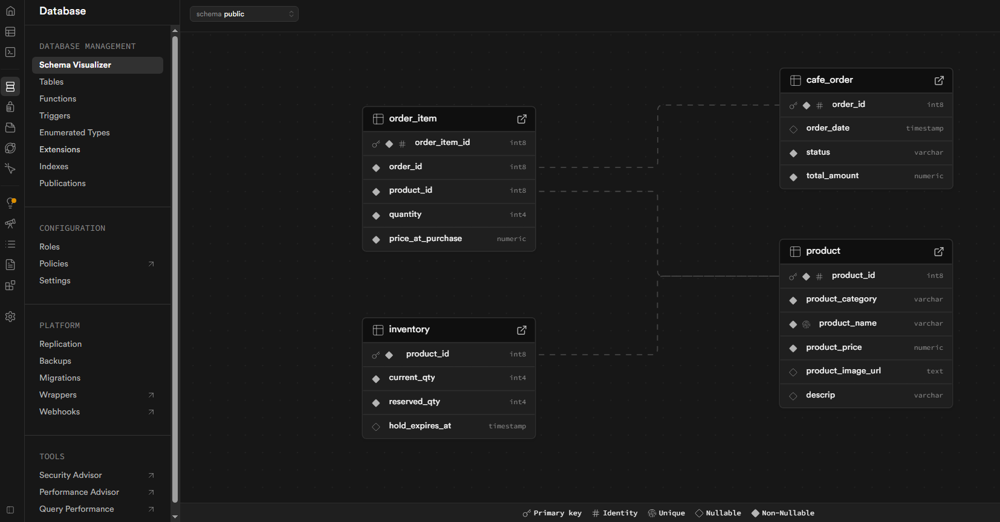

# Café E-commerce Backend

## About
A Spring Boot-powered backend designed to manage café orders and real-time inventory. This project focuses on solving the "overselling" problem by implementing a custom reservation system that handles the complete lifecycle of a customer transaction.

### Database Schema

*I designed and structured this PostgreSQL schema to manage the relationships between products, real-time stock levels, and order history.*

---

## Technologies Used
* **Java 17**
* **Spring Boot** (Spring Web, Spring Data JPA)
* **PostgreSQL** (Hosted via Supabase)
* **Hibernate**
* **Maven**

---

## Core Features
* **Inventory Reservation:** Implements logic to hold stock for 15 minutes during the checkout process. This ensures that "in-stock" items are guaranteed for the user currently ordering.
* **Order Management:** Manages state transitions for orders (PENDING, PAID, or EXPIRED). For this demo, the transition to 'PAID' is triggered by a simulated payment confirmation.
* **Automated Cleanup:** Utilizes `@Scheduled` tasks to monitor the database and automatically release expired inventory holds back to the available stock.
* **Clean Data Transfer:** Uses **Java Records** for lightweight, immutable DTOs and `@ControllerAdvice` for centralized, meaningful error responses (e.g., "Insufficient Stock").
* **Data Integrity:** Combines manual schema design with JPA transactional management to ensure multi-table updates (Orders, Items, and Inventory) remain consistent.

---

## Current Status & Roadmap
This project is currently in **active development**.

* **[In Progress]** Integrating with the React frontend (**Indie Bites Café**) to enable end-to-end checkout.
* **[In Progress]** Implementing the "Pay" button logic to trigger final state transitions from PENDING to PAID.
* **[Upcoming]** Deploying the backend to **Render** to provide a live API for the frontend.

---